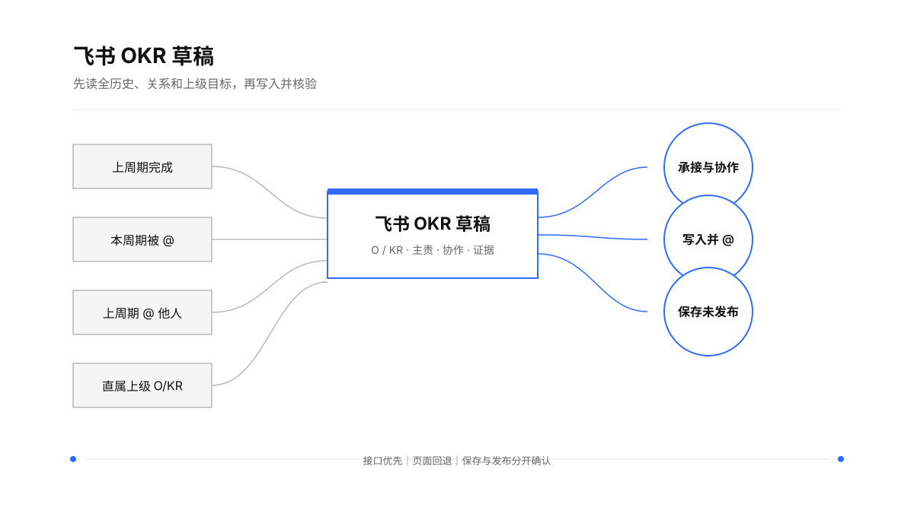

<div align="center">

### **你的 OKR，我来帮你写。**

*Your OKR is my duty.*


<br>

</div>

---

# 飞书 OKR 草稿｜Feishu OKR Drafter

> **主题：写出经得起严格评审的结果承诺。**

飞书 OKR 草稿是一个面向 Agent 的 OKR 工作能力：读取当前目标、历史完成情况、上下级承接和真实协作关系，写出高质量的 Objective / Key Result 草稿；经用户确认后，直接写入飞书 OKR、艾特对应协作者，并回读保存与发布状态。

英文标识：`feishu-okr-drafter`　｜　中文名：**飞书 OKR 草稿**

## About｜它到底是什么

它服务的核心场景，是一名员工要在新周期写出一套能拿到 OKR 评审桌上讨论的个人目标。

这件事需要的能力不止是把几段工作描述改得更像 OKR。Agent 要先看懂过去完成了什么、哪些事情没有闭环、当前周期谁在期待协作、直属上级把重点放在哪里，再把这些事实压缩成少数几条有结果、有指标、有时间、有主责、有承接关系的 O/KR。

它把“写得像 OKR”和“写得经得起评审”区分开。前者是句式问题，后者涉及业务取舍、历史连续性、目标难度、结果证据、上下级承接和协作边界。

## 一张图看懂

<p align="center">
  
</p>

## 它最重要的价值：把 OKR 质量写进流程

高质量 OKR 不是靠最后润色出来的。质量门槛要进入读取、判断、改写和写入的每一步。

飞书 OKR 草稿对每套 O/KR 至少追问七件事：

1. **价值**：这个 Objective 要改变什么业务结果？为什么值得占用本周期资源？
2. **取舍**：它是否代表一条高优先级主线？哪些工作明确排除在外？
3. **结果**：每条 KR 能否描述做到什么程度，而非只描述做了什么？
4. **证据**：目标值、基线、日期、完成度和协作关系是否有来源？
5. **承接**：个人目标承接直属上级哪条结果？承接深度和边界是什么？
6. **协作**：谁对结果负责，谁提供关键输入，谁需要被 @，依赖是否已经确认？
7. **评审**：陌生协作者能否看懂、判断、追问，并在周期结束时验证完成程度？

回答不完整时保留 `[待确认]`，把缺口摆到桌面上。漂亮的句子不能替代缺失的事实。

## 严格的 OKR 质量门槛

| 维度 | 通过标准 | 常见低质量信号 |
| --- | --- | --- |
| Objective | 说清方向、价值和本周期的阶段结果 | 口号、战略空话、日常职责堆叠 |
| 聚焦 | 一条 O 代表一条主要结果主线 | 每个项目都单独变成一个 O |
| 挑战 | 需要取舍和主动投入才能完成 | 把确定会发生的工作写成目标 |
| KR 结果性 | 写“做到什么程度”，有客观验收条件 | “推进、负责、完成、持续优化”停在动作层 |
| 可衡量 | 有基线、目标值、比例、数量或定性验收标准 | “提升、加强、优化”没有起点和终点 |
| 时间边界 | 有周期内截止点或阶段节点 | 没有日期，或把长期愿景直接塞进本周期 |
| 责任边界 | 每个关键结果有唯一主责，协作者角色清楚 | 把协作者写成共同 Owner |
| 纵横对齐 | 能指向上级承接、同级依赖和实际协作 | 相关性被误写成已对齐 |
| 历史连续性 | 延续事项写出本周期新增结果 | 原样复制上周期 OKR |
| 语言质量 | 陌生同事一次阅读能理解并复述 | 黑话、抽象名词、句式完整但信息不足 |

每条 KR 都要能回答：**它支撑 O 的哪一部分？周期结束时凭什么判断完成？**

## 它读取什么

### 上周期：看完成情况，不复制旧答案

读取上一周期的 O/KR、指标、进展、评分、评论、绩效总结和自评，区分已完成、部分完成、未完成、目标变化和证据缺失。

- 已完成事项进入基线、能力证明或案例证据；
- 未完成事项重新判断是战略延续、执行未闭环、指标缺失还是写法问题；
- 已形成但尚未复制的能力，转成规模化、标准化、他人可运行或商业结果；
- 新周期 KR 必须写出新增阶段结果，避免“过去做过什么，未来继续做什么”的机械续写。

### 本周期：看谁期待什么协作

读取本人 O/KR 中被 @ 的对象、来源、协作期待、交付节点和责任边界。被 @ 形成协作候选，是否成为本人的承诺要看主责、内容、周期和双方确认。

### 上周期：看协作是否真正闭环

回看本人上周期 @ 过谁、为什么 @、协作结果如何。识别持续依赖、重复找人、协作失配和可以沉淀为团队机制的关系，只保留当前周期仍然有效的协作线索。

### 直属上级：看个人目标承接什么

读取直属上级当前周期 OKR 的重点、顺序、指标口径和协作边界，判断个人 O/KR 属于承接、支撑、横向协作还是独立主线。上级目标缺失、身份不明或周期无法核验时，明确标注读取边界。

## 标准工作流

```text
确认身份与周期
      ↓
读取当前 OKR、历史 OKR、@ 关系和直属上级 OKR
      ↓
建立事实台账与关系台账
      ↓
聚类业务结果，生成 O / KR 草稿
      ↓
按质量门槛检查结果、指标、日期、主责、承接和协作
      ↓
用户确认后写入飞书，并写入真实 mention
      ↓
回读 O/KR、@ 人员、保存状态；确认没有发布
```

### 关系台账

```text
关系类型 → 来源周期 → 来源 O/KR → 对方 → 协作期待
         → 本周期处理方式 → 主责边界 → 是否已确认
```

这张台账让历史结果、纵向承接、横向协作和待确认关系保持可追溯，避免混成一张待办清单。

## 直接写入飞书并艾特协作者

用户明确要求写入时，执行以下顺序：

1. 核验当前用户、租户、周期、目标归属和完整草稿；
2. 按 O/KR 建立“写入与 @ 清单”，记录每个协作者的对象、原因和来源；
3. 用通讯录搜索把姓名或邮箱解析为真实 `open_id`；多候选、跨租户或身份不足时暂停该条 @，要求确认；
4. 接口可用时优先使用 OKR API，将 mention 写入对应 O/KR；
5. 接口不可用时，通过已登录的飞书 OKR 页面和用户选择器完成真实艾特；
6. 写入后回读 O/KR 数量、正文、顺序、日期、mention、保存状态和“发布”按钮。

结果分开报告：`已生成`、`已保存`、`已艾特`、`未艾特及原因`、`未发布`。其中任何一项没有读回证据，都保留为待核验。

## Agent 调用方式

### 触发示例

```text
用飞书 OKR 草稿，按严格 OKR 标准，基于我上周期完成情况、本周期被 @ 的情况和直属上级 OKR，起草本周期个人 OKR。

读取我上周期 OKR 和上周期 @ 他人的情况，再结合当前周期协作关系，帮我重写一版高质量 OKR。

把这版 OKR 写入飞书，艾特每条 KR 对应的协作者；保存但不要发布。

逐条检查这套 O/KR 是否结果导向、可衡量、具备时间边界，并指出无法通过严格评审的地方。
```

### 建议读取顺序

1. 先读取 `SKILL.md`，理解触发边界和总工作流；
2. 写作和质量判断读取 `references/okr-writing-principles.md`；
3. 涉及上下级承接、协作冲突和对齐状态，读取 `references/okr-alignment-review.md`；
4. 涉及 API、页面、mention、保存和发布，读取 `references/feishu-okr-operations.md`；
5. 明确写入授权后才执行写入，写入后必须回读。

## 安装

```bash
git clone https://github.com/TongyiDai/feishu-okr-drafter.git \
  "${CODEX_HOME:-$HOME/.codex}/skills/feishu-okr-drafter"
```

完成后重启 Agent，或直接使用：

```text
使用 $feishu-okr-drafter
```

实际写入飞书需要当前 Agent 具备 `lark-okr`、`lark-contact` 和页面回退所需的浏览器能力，并且当前账号拥有对应 OKR 权限。

## 目录结构

```text
feishu-okr-drafter/
├── SKILL.md
├── README.md
├── agents/openai.yaml
├── assets/
│   ├── okr-workflow.scene.json
│   └── okr-workflow.svg
└── references/
    ├── feishu-okr-operations.md
    ├── okr-alignment-review.md
    └── okr-writing-principles.md
```

## 重要边界

- 不凭空补写目标值、基线、截止日期、负责人、业务结果或对齐对象；
- 不把历史完成事项原样复制成新周期 KR；
- 不把被 @、@ 他人或“看起来相关”自动当作已对齐；
- 不把正文里的 `@姓名` 当作真实 mention；
- 不混用个人与公司飞书租户；
- 不在没有读回证据时声称已保存、已艾特或已发布；
- 公开分享前使用虚构示例，扫描真实路径、租户信息、Token、用户 ID 和内部数据。

## 当前状态

这是一个可直接加载的早期版本。当前重点是：高质量 OKR 起草、历史承接、直属上级对齐、四类 @ 关系、真实 mention、飞书写入和保存核验。OKR 评分、进度更新和组织级绩效流程不进入默认写入路径，除非用户明确要求。

## English introduction

### Feishu OKR Drafter

`feishu-okr-drafter` is an Agent Skill for producing high-quality Feishu OKRs that can survive a strict review.

It reads the current cycle, the previous cycle's completion evidence, incoming and outgoing @ relationships, the direct manager's OKRs, and relevant work materials. It turns those facts into focused Objectives and outcome-oriented Key Results with explicit value, metrics, baselines, dates, ownership, alignment, and collaboration boundaries.

The quality bar is part of the workflow. The Skill checks whether each KR describes an observable result, whether the full set supports the Objective, whether the target has evidence, whether the scope fits the cycle, and whether the relationship to the manager's and collaborators' OKRs is clear.

After user confirmation, it writes the draft through the Feishu OKR API or the page workflow, resolves names to real Feishu user IDs, mentions the right collaborators, and verifies the saved and unpublished state. It keeps draft, saved, mentioned, aligned, and published as separate states.

## 许可

当前仓库未声明开源许可证，适合个人或组织内部使用。若要公开分发，请先补充许可证和脱敏示例。
